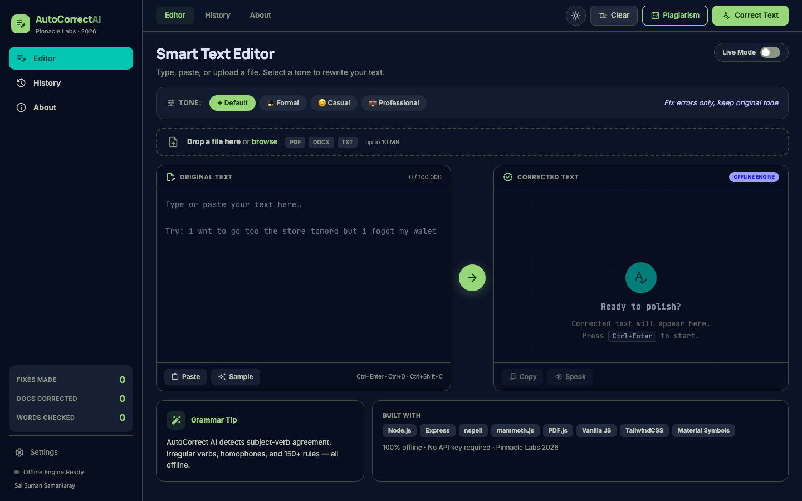

# AI Autocorrect Pro — Pinnacle Labs 2026

> 🧠 **AI-powered offline writing assistant** — instant grammar correction, tone rewriting (Formal / Casual / Professional), plagiarism detection & document export. Built with Node.js, Vanilla JS & Nspell. No cloud. No API keys. Pinnacle Labs 2026.

Built by **Sai Suman Samantaray** during the **Pinnacle Labs AI Internship 2026**.

---

## 🖥️ App Preview



> **Smart two-pane editor** — type or paste your text on the left, get the AI-corrected version on the right. Features a sidebar with live session stats, tone selector, file upload, and one-click plagiarism detection — all running 100% offline on your machine.

---

## ✨ Features

| Feature | Description |
|---|---|
| ⚡ **Live Mode** | Auto-corrects 1.5s after you stop typing |
| 🎭 **Tone Selector** | Rewrite in Default / Formal / Casual / Professional |
| 🔍 **Diff View** | Red/green highlights show exactly what changed |
| 📋 **Corrections List** | Every fix listed with type badge + reason |
| 📊 **Accuracy Cards** | Before/after accuracy scores |
| 📄 **File Upload** | Drag-and-drop PDF, DOCX, TXT (up to 10 MB) |
| ⬇️ **Export** | Download corrected text as TXT, DOCX, or PDF |
| 🔊 **Text-to-Speech** | Read corrected text aloud |
| 🕵️ **Plagiarism Checker** | Scans 450+ AI clichés & known phrases — offline |
| 📜 **History Tab** | Full session correction log |
| ⚙️ **Settings** | Custom dictionary, keyboard shortcuts, dark/light theme |

---

## 🛠️ Tech Stack

```
Node.js  ·  Express  ·  Vanilla JavaScript  ·  HTML5  ·  CSS3  ·  Nspell
mammoth.js (DOCX)  ·  PDF.js (PDF)  ·  Web Speech API (TTS)
```

**Zero cloud dependency** — all processing happens locally on your machine.

---

## 🚀 Getting Started

### Prerequisites
- Node.js >= 18.0.0
- npm

### Installation

```bash
# Clone the repo
git clone https://github.com/YOUR_USERNAME/autocorrect-ai-pro.git
cd autocorrect-ai-pro

# Install dependencies
npm install

# Start the server
npm start
```

Then open **http://localhost:3000** in your browser.

### Development (auto-restart)

```bash
npm run dev
```

---

## 📁 Project Structure

```
autocorrect-ai-pro/
├── public/
│   ├── index.html      # Main UI
│   ├── app.js          # Frontend logic
│   └── style.css       # Styles
├── assets/
│   └── homepage.png    # App screenshot (README)
├── server.js           # Express backend + spelling engine
├── package.json
└── .env.example        # Environment variable template
```

---

## ⌨️ Keyboard Shortcuts

| Shortcut | Action |
|---|---|
| `Ctrl + Enter` | Correct text |
| `Ctrl + D` | Clear editor |
| `Ctrl + Shift + C` | Copy corrected text |

---

## 📝 Environment Variables

Copy `.env.example` to `.env` and configure if needed:

```bash
cp .env.example .env
```

---

## 📄 License

MIT License — © 2026 Sai Suman Samantaray

---

## 👤 Author

**Sai Suman Samantaray**  
AI Intern · Pinnacle Labs 2026  
B.Tech CSE · CV Raman Global University

[](https://linkedin.com/in/saisumansamantaray)
[](https://github.com/Saisuman55)
